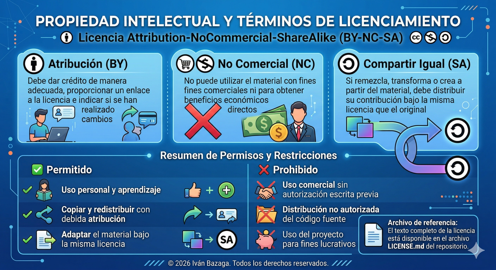

# Licencia de Uso Privado



**Para más detalles, consulte el texto completo de la licencia en:** [Licencia](https://creativecommons.org/licenses/by-nc-sa/4.0/)

## Proyecto: URBAN MANAGER

**Propietario:** Iván Bazaga  
**Email:** ivan.cpweb@gmail.com
**Fecha:** 19-03-2026

---

## 🔒 TÉRMINOS DE USO PRIVADO

Este repositorio y todo su contenido, incluyendo pero no limitado a:
- Workflows
- Configuraciones
- Plantillas de automatización
- Agentes de IA
- Documentación
- Scripts y código fuente

Son **propiedad exclusiva** de Iván Bazaga y están protegidos por las leyes de derechos de autor y propiedad intelectual.

## ⚠️ RESTRICCIONES

### ❌ PROHIBIDO:
- **Distribución no autorizada**: No se permite compartir, distribuir, o hacer público este contenido sin autorización escrita explícita.
- **Uso comercial no autorizado**: Prohibido el uso de estos recursos para fines comerciales sin licencia previa.
- **Modificación y redistribución**: No se permite modificar y redistribuir el contenido bajo ninguna circunstancia.
- **Ingeniería inversa**: Prohibido el análisis del contenido para replicar la lógica de negocio.

### ✅ PERMITIDO (CON AUTORIZACIÓN):
- **Uso personal**: Para aprendizaje y desarrollo personal previa autorización.
- **Compartir**: Copiar y redistribuir el material en cualquier medio o formato.
- **Adaptar**: Remezclar, transformar y crear a partir del material.

## 📋 CONDICIONES DE ACCESO

El acceso a este repositorio se otorga bajo las siguientes condiciones:

1. **Atribución (BY)**: Debe dar crédito de manera adecuada, proporcionar un enlace a la licencia e indicar si se han realizado cambios.
2. **No Comercial (NC)**: No puede utilizar el material con fines comerciales ni para obtener beneficios económicos directos.
3. **Compartir Igual (SA)**: Si remezcla, transforma o crea a partir del material, debe distribuir su contribución bajo la misma licencia que el original.

## ⚖️ ASPECTOS LEGALES

### Jurisdicción
Este acuerdo se rige por las leyes del país o región de Iván Bazaga y cualquier disputa será resuelta en los tribunales competentes.

### Violaciones
Las violaciones de esta licencia pueden resultar en:
- Acciones legales por infracción de derechos de autor
- Reclamaciones por daños y perjuicios
- Medidas cautelares y órdenes de cese y desistimiento

### Limitación de Responsabilidad
El contenido se proporciona "tal como está" sin garantías de ningún tipo. Iván Bazaga no se hace responsable de daños derivados del uso del contenido.

## 🔄 ACTUALIZACIONES DE LICENCIA

Esta licencia puede ser actualizada en cualquier momento. Los usuarios serán notificados de cambios significativos.

**Versión:** 1.0.0 
**Fecha de última actualización:** 19-03-2026

---

## ☎️ Información de Contacto

| Plataforma | Enlace | Descripción |
|------------|--------|-------------|
| GitHub | [@IvBanzaga](https://github.com/IvBanzaga/) | Repositorios y proyectos de código |
| LinkedIn | [Iván Bazaga](https://www.linkedin.com/in/ivan-bazaga-gonzalez/) | Perfil profesional y networking |
| Email | [ivan.cpweb@gmail.com](mailto:ivan.cpweb@gmail.com) | Contacto directo para oportunidades |
| Portfolio | [Ivandevs.netlify.app](https://ivandevs.netlify.app/) | Showcase de proyectos y skills |
| Proyecto | [Creamiproyecto.com](https://creamiproyecto.com/) | Showcase de proyectos y skills |

### 🧰 Stack Tecnológico de Especialización

```
Frontend: Java SprinBoot • Astro • Angular 20 • TypeScript • RxJS • Bootstrap 5 • HTML5 • CSS3
Tools: Angular CLI • Git • VS Code • Prettier • Jasmine • Karma
Learning: NgRx • PWA • Node.js • Express • Mysql •  Oracle
```

**📧 ¿Tienes preguntas o sugerencias?**  
*¡No dudes en abrir un issue o contactarme directamente!*

## 📝 RECONOCIMIENTO

Al acceder a este repositorio, confirmas que has leído, entendido y aceptas cumplir con todos los términos establecidos en esta licencia.

**© 2026 Iván Bazaga. Todos los derechos reservados.**
